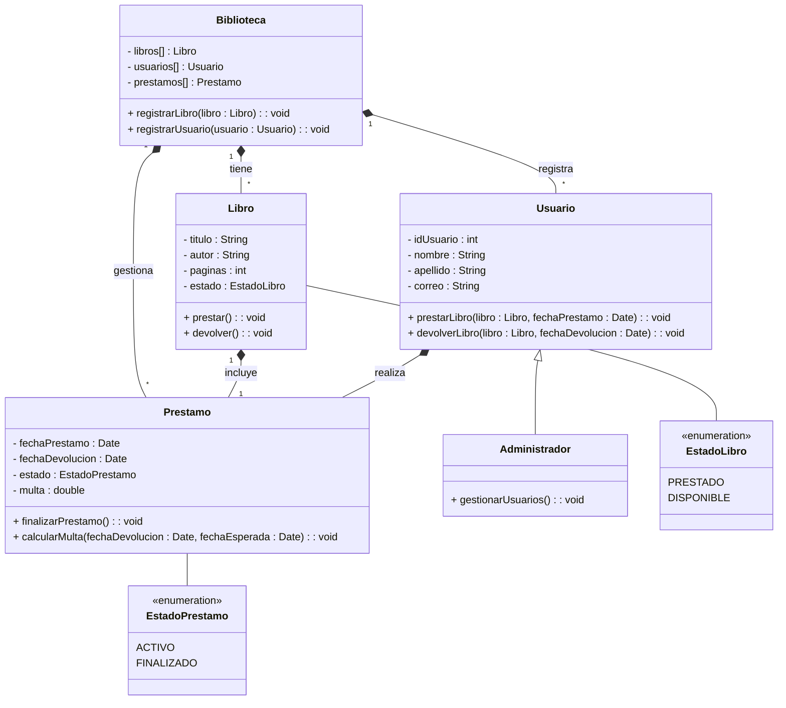

# TP1 - Practica de UML

## 1. Sistema de Biblioteca

Se desea modelar un sistema simplificado para una biblioteca. La biblioteca tiene libros que pueden ser prestados a los usuarios registrados. Cada usuario puede prestar varios libros, pero un libro solo puede estar en posesión de un usuario a la vez. Si el libro no está prestado, está disponible para el próximo usuario.

**Requisitos:**

- Cada libro tiene un título, autor, número de páginas y un estado (prestado o disponible).
- Los usuarios se identifican por un ID único, un nombre y pueden tener varios libros
prestados.
- La biblioteca debe conocer todos los libros que posee y a los usuarios registrados.
- Cuando un libro es prestado, el sistema debe registrar la fecha de préstamo y la fecha de
devolución.

### Diagrama de clases

#### Aclaración

Algunos atributos y/o métodos no eran pedidos expresos en la consigna, pero creí que era apropiado agregarlos.
