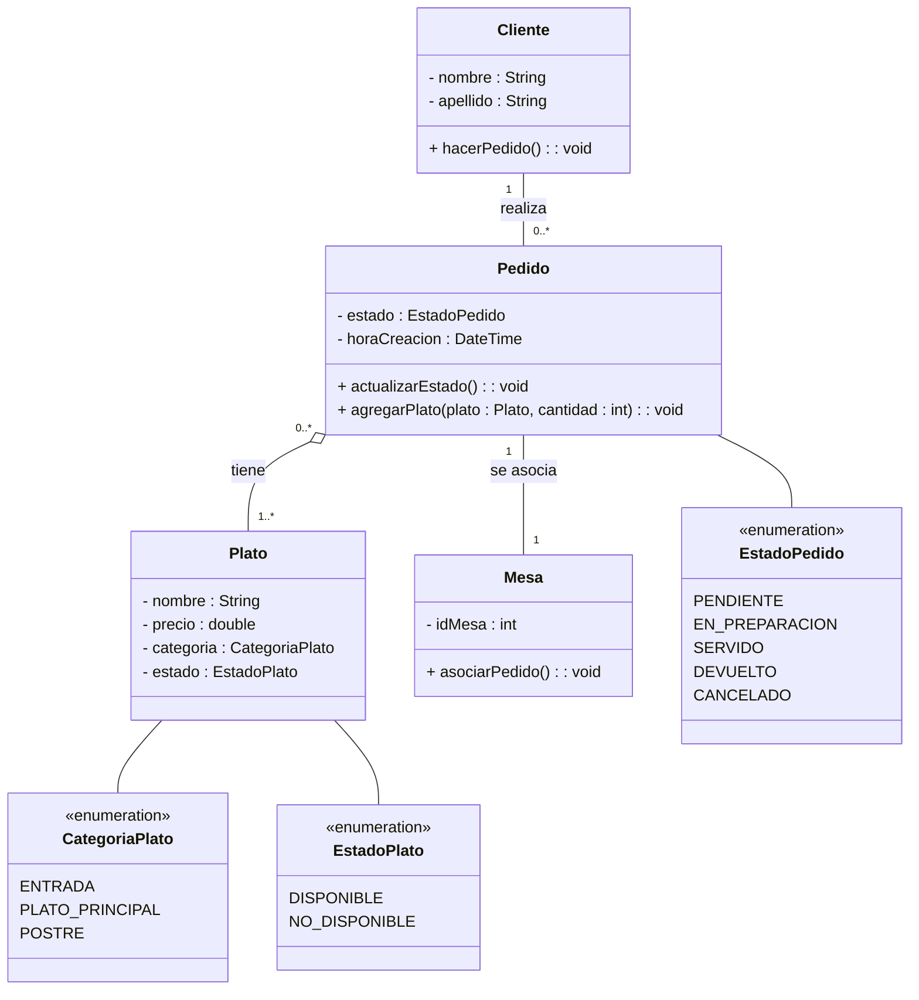

# TP1 - Practica de UML

## 2. Sistema de Gestión de Pedidos de Restaurante

Se desea desarrollar un sistema para gestionar los pedidos de un restaurante. El sistema debe permitir registrar los pedidos que realizan los clientes, asociarlos a las mesas y hacer un seguimiento del estado de cada pedido.

**Requisitos:**

- Un pedido contiene uno o varios platos, y cada plato tiene un nombre, un precio y una
categoría (entrada, plato principal, postre).
- Un cliente puede hacer varios pedidos, y un pedido puede estar asociado a una mesa del
restaurante.
- Las mesas tienen un número de identificación único.
- Los pedidos tienen un estado (pendiente, en preparación, servido) y una hora de creación.

### Diagrama de clases

#### Aclaración

Algunos atributos y/o métodos no eran pedidos expresos en la consigna, pero creí que era apropiado agregarlos.
